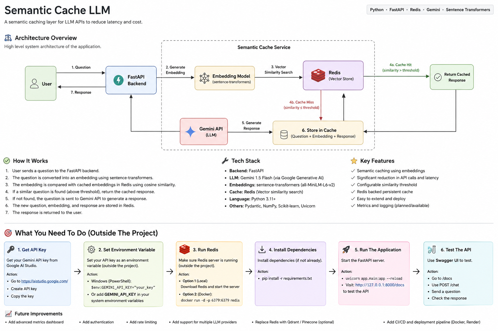

# Semantic Cache LLM

A production-ready semantic caching layer for Large Language Model (LLM) APIs that reduces latency and API costs by serving cached responses for semantically similar requests.

---

## 🏗️ Architecture



---

## 🚀 Features

- Semantic caching using embeddings
- FastAPI REST API
- Gemini API integration
- Sentence Transformer embeddings
- Cosine similarity search
- Configurable similarity threshold
- Simple frontend for testing
- Modular project structure
- Environment variable support

---

## 🛠️ Tech Stack

- Python
- FastAPI
- Streamlit (Frontend)
- Google Gemini API
- Sentence Transformers
- Scikit-learn
- Python-dotenv
- Uvicorn

---

## 📂 Project Structure

```text
semantic-cache-llm/
│
├── app/
├── assets/
│   └── architecture.png
├── data/
├── tests/
├── frontend.py
├── README.md
├── requirements.txt
└── .env
```

---

## ⚙️ Installation

```bash
git clone <your-repository-url>
cd semantic-cache-llm

python -m venv .venv

# Windows
.venv\Scripts\activate

pip install -r requirements.txt
```

---

## ▶️ Run Backend

```bash
python -m uvicorn app.main:app --reload
```

Open:

```
http://127.0.0.1:8000/docs
```

---

## 🖥️ Run Frontend

```bash
streamlit run frontend.py
```

---

## 📌 Future Improvements

- Redis cache
- Qdrant vector database
- Docker
- Prometheus metrics
- Grafana dashboard
- CI/CD pipeline
- Cloud deployment